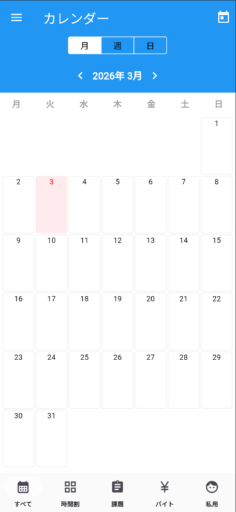
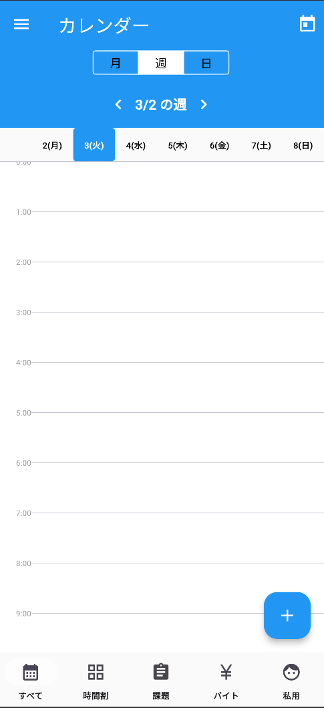
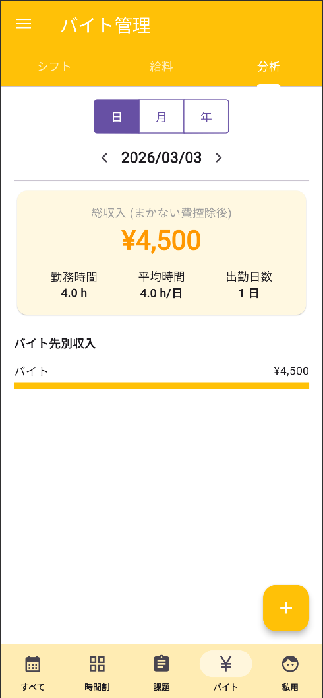
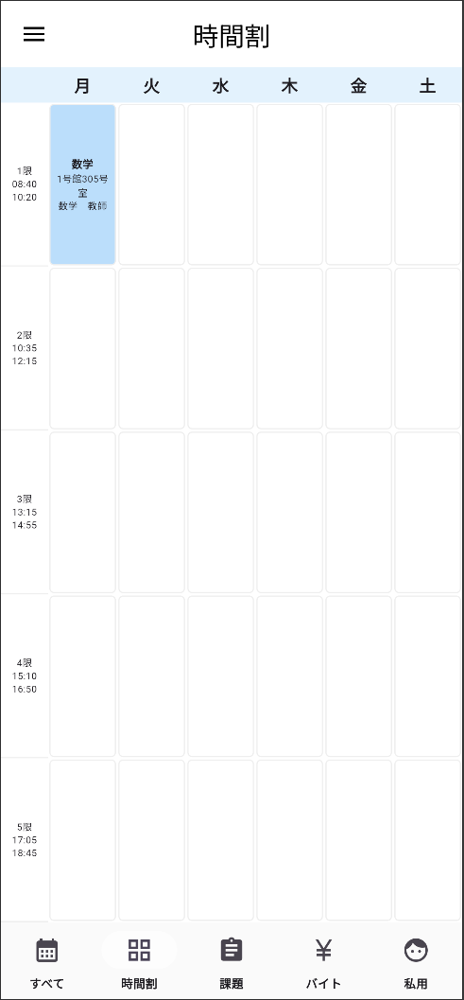
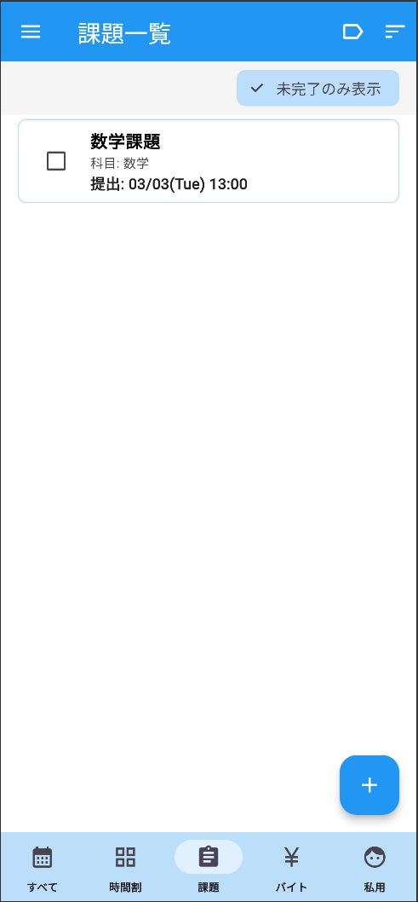

# CampusMate (キャンパスメイト) 🎓
**金沢工業大学（KIT）生のための、時間割・課題・バイト管理オールインワンアプリ**

<table border="0">
  <tr>
    <td width="33%" align="center"><b>📅 トップ画面 (月)</b></td>
    <td width="33%" align="center"><b>🗓 スケジュール (週)</b></td>
    <td width="33%" align="center"><b>💰 バイト分析 (推し機能)</b></td>
  </tr>
  <tr>
    <td></td>
    <td></td>
    <td></td>
  </tr>
  <tr>
    <td width="33%" align="center"><b>📚 時間割・出席管理</b></td>
    <td width="33%" align="center"><b>📝 課題管理 (フィルタ付)</b></td>
    <td width="33%" align="center"><b>✨ 実績入力</b></td>
  </tr>
  <tr>
    <td></td>
    <td></td>
    <td></td> 
  </tr>
</table>
## 📖 概要
「CampusMate」は、大学生活に必要なスケジュール管理を一つのアプリで完結させるために開発されたPWA（プログレッシブウェブアプリ）です。
時間割の出席管理、課題の提出期限、アルバイトのシフト管理・給与計算を統合し、学生生活をトータルサポートします。

**デモサイト:** [https://campus-mate-1.netlify.app](https://campus-mate-1.netlify.app)

## ✨ Ver 16.3 の新機能・主な機能

### 1. 💰 高機能バイト管理システム (New!)
ただ予定を入れるだけでなく、**「シフト管理」「実績入力」「給与分析」**の3つのタブで完全に管理できるようになりました。
* **シフト:** バイト先ごとに色分けされた視認性の高いリスト表示。
* **実績入力:** 勤務後にタップするだけで、実際の労働時間と給料を入力可能。まかないの有無も記録できます。
* **分析ダッシュボード:**
    * 日・月・年ごとの収入推移をグラフと数値で可視化。
    * 「まかない代」を差し引いた実質手取り額を自動計算。
    * バイト先ごとの収入比率を表示。

### 2. 📝 課題管理 & フィルタリング
* **未完了フィルタ (New):** 終わっていない課題だけをワンタップで絞り込み表示。提出漏れをゼロにします。
* **提出期限の可視化:** 締め切り日時を設定し、リストとカレンダーで確認可能。
* **完了管理:** チェックを入れるとグレーアウト＆取り消し線で達成感を演出。

### 3. 📅 スマート時間割
* **詳細表示:** 科目名だけでなく、教室名や担当教員名も一覧表示し、移動教室の確認をスムーズにしました。
* **出席カウンター:** タップ操作で「出席」「欠席」「遅刻」をカウントし、履修状況を可視化。

### 4. 🗓 統合カレンダー (Month / Week / Day)
* **週表示・日表示:** 予定の重複を自動計算して綺麗に並べるアルゴリズムを実装。
* **終日設定:** 私用などの終日イベントに対応。

## 🛠 使用技術

* **Framework:** Flutter (Web)
* **Language:** Dart
* **Platform:** Web (PWA) / iOS & Android (Ready)
* **State Management:** `setState` (StatefulWidget)
* **Local Storage:** `shared_preferences` (完全オフライン対応)
* **UI Components:** `Cupertino` (iOS style), `Material 3`

## 🔥 工夫した点・技術的挑戦

### 1. バイト代「分析ロジック」の実装
「シフトを入れる」だけでなく「稼いだ額を振り返る」ことに価値があると考え、分析機能を実装しました。
特に、バイト先ごとに設定された「まかない代」を実績から自動控除するロジックや、期間（日・月・年）に応じた集計処理をDart言語で実装し、グラフ状のUIで直感的に分かるように工夫しました。

### 2. ユーザー体験（UX）を意識した入力フロー
「予定を入れる時」と「働いた後」ではユーザーの心理が異なります。
そのため、予定追加画面とは別に、実績入力専用のタブとダイアログを用意し、少ないタップ数で正確な給料記録ができるようにUIを設計しました。

### 3. タイムゾーンと日付処理の厳密化
カレンダーアプリの肝である日付処理において、TimeOfDayとDateTimeの変換ロジックを独自に構築し、深夜帯のシフトや日付をまたぐ操作でもズレが発生しないように調整しました。

## 🚀 今後の展望 (Roadmap)
* [ ] **Firebase連携:** データのクラウド保存と、PC・スマホ間のデータ同期。
* [ ] **Googleカレンダー連携:** 大学の公式カレンダーとのインポート機能。

## 👤 Author
* 金沢工業大学 情報理工学部 情報工学科 1年
* 岡田 悠暉 (Yuki Okada)